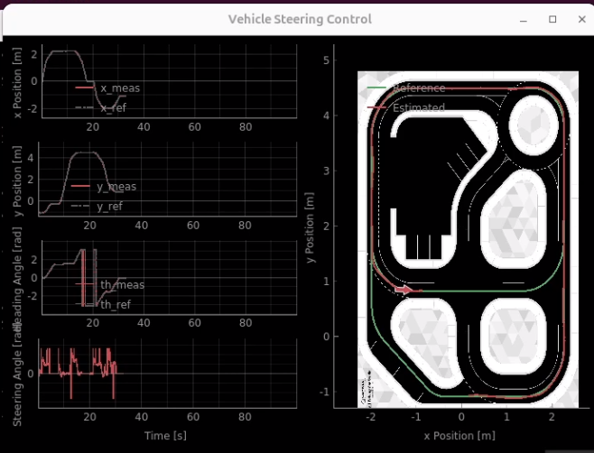

This is our submission for quanser competition 2025

We have provided implementaion of the [deltaied scenario](https://github.com/quanser/ACC-Competition-2025/blob/main/Detailed_Scenario.md) in Quanser environment through python devlopment.

The path for navigation in the map is generated through a node sequence , we have utilized quanser hal and pal library for localization in the Quanser
 roadmap environment 

 WE have intialsed two threads to complete the task ,the control thread is used for updating cars postion and providing control inputs and a yolo thread is used for object detection as the vehicle navigates through the map.

 Yolo Based Object Detection:
 In this thread we have utilised a custom trained yolov11n model, trained on traffic signals, traffic signs and also a person for objectdetection and avoidance.

we have set flags for stop sign, traffic signals (red,green,yellow) and pedestrain detection in this loop.
We have utilised the width of bounding box to estimate the diatance of detected object from the vehicle instead of using depth image, to stop at appropriate distance from the detected object.

To deal with multiple object of same type for example when our vehicle stops at the traffic intersection it can detect three traffic lights.we will choose the traffic light based on the direction of the waypoints we have to follow, As shown in the image below.

Control Loop:
we have utilised hal and pal libraries for localization(using QcarEKF and qcarGPS) , we have used staney controller based algorithm for to provide control input to track a reference speed(for speed controller) and stanley gain and heading error (for steering control),To track the way points better we dynamically change the reference tracking speed and the Stanley gain(steering control) according to orientaion of waypoints ahead with respect to the vehicle.
