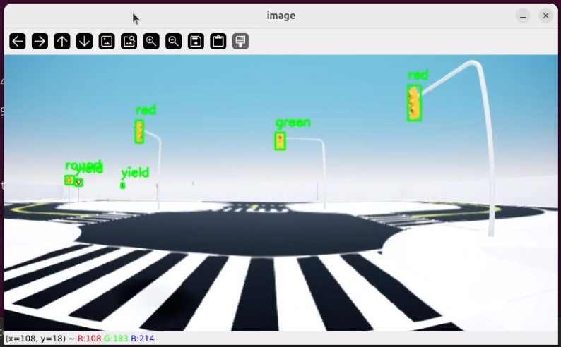
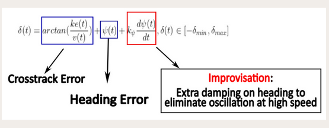

<!-- This is our submission for quanser competition 2025

We have provided implementaion of the [deltaied scenario](https://github.com/quanser/ACC-Competition-2025/blob/main/Detailed_Scenario.md) in Quanser environment through python devlopment.As an addition requirement we have installed ultralytics package in our dokcer environment, we have provided requirement and docker file for same.

The path for navigation in the map is generated through a node sequence , we have utilized quanser hal and pal library for localization in the Quanser
 roadmap environment 

 WE have intialsed two threads to complete the task ,the control thread is used for updating cars postion and providing control inputs and a yolo thread is used for object detection as the vehicle navigates through the map.

 Yolo Based Object Detection:
 In this thread we have utilised a custom trained yolov11n model, trained on traffic signals, traffic signs and also a person for objectdetection and avoidance.

we have set flags for stop sign, traffic signals (red,green,yellow) and pedestrain detection in this loop.
We have utilised the width of bounding box to estimate the diatance of detected object from the vehicle instead of using depth image, to stop at appropriate distance from the detected object.

To deal with multiple object of same type for example when our vehicle stops at the traffic intersection it can detect three traffic lights.we will choose the traffic light based on the direction of the waypoints we have to follow, As shown in the image below.

Control Loop:
we have utilised hal and pal libraries for localization(using QcarEKF and qcarGPS) , we have used staney controller based algorithm for to provide control input to track a reference speed(for speed controller) and stanley gain and heading error (for steering control),To track the way points better we dynamically change the reference tracking speed and the Stanley gain(steering control) according to orientaion of waypoints ahead with respect to the vehicle. -->
# Quanser Competition 2025 Submission

This repository contains our official submission for the **Quanser Autonomous Vehicle Challenge 2025**.

## Scenario Implementation

We have implemented the [Detailed Scenario](https://github.com/quanser/ACC-Competition-2025/blob/main/Detailed_Scenario.md) in the Quanser simulated environment using **Python**.

As part of the extended requirements, we included the **Ultralytics YOLO** package in our Docker environment. The repository includes:

- `requirements.txt` — for all Python package dependencies
- `Dockerfile` — for setting up the complete containerized development environment

## Navigation and Localization

The navigation path is generated using a **sequence of predefined nodes (waypoints)** on the Quanser roadmap. For localization, we utilize the **Quanser HAL** and **PAL** libraries within the simulation environment.

## System Architecture

Our system uses a **multi-threaded design**:

- **Control Thread**: Handles real-time vehicle localization, position updates, and control signal generation.
- **YOLO Thread**: Executes object detection continuously as the vehicle navigates through the environment.

## YOLO-Based Object Detection

The object detection thread employs a **custom-trained YOLOv11n model**, trained specifically to identify:

- Traffic signals (Red, Yellow, Green)
- Stop signs
- Pedestrians

### Detection and Response Logic

Within the detection loop, we implement logic to:

- Set flags for **stop sign**, **traffic signal**, and **pedestrian** detection.
- Estimate the **distance to objects** using the **bounding box width**, rather than relying on depth images. This enables the vehicle to halt at an appropriate distance from detected objects without requiring additional depth sensors.

### Handling Multiple Detected Objects

At traffic intersections, the vehicle may detect **multiple traffic lights** (e.g., three at once). To resolve ambiguity, we select the traffic light relevant to the **direction of upcoming waypoints**. This ensures correct traffic signal interpretation based on the intended route.

## 🚦 Traffic Sign & Light Recognition

We implemented and optimized multiple components to meet the competition goals effectively:

### 🔍 Detection Model

- **Model Used:** YOLOv11  
- **Training:** Manually labeled data collected by driving the vehicle in the actual environment.

### 🧠 Trained Classes

- **Traffic Lights:**  
  - Red  
  - Green  
  - Yellow

- **Traffic Signs:**  
  - Stop  
  - Yield  
  - Roundabout  
  - Pedestrian (person)  
  - Cone

### 🔄 Dynamic Traffic Light Selection at Intersections

- The vehicle **uses the slope of upcoming waypoints** to identify the relevant traffic light.
- It **checks the status of the selected light** (red/green) to decide whether to stop or proceed.
- This logic **generalizes across all routes**, even when the trajectory dynamically changes.

## 🚗 Competition Components Overview

We implemented and optimized multiple components to meet the competition goals effectively:

---

### 🧍 Pedestrian Detection & Response

- **Pedestrian detection** is handled by the same **YOLOv11** model.
- The vehicle estimates the **distance to a pedestrian** using bounding box dimensions.
- If a person is detected **at or near a crosswalk**, the vehicle **halts and waits** until the path is clear.

---

### 🕒 Time-Efficient Speed & Control Strategy

To minimize travel time without compromising safety (i.e., staying within lane boundaries):

- The vehicle **adjusts reference speed based on the slope** of upcoming waypoints:
  - **Straight path (slope ≈ 0):** High speed → `1.25`
  - **Curved path:** Reduced speed → `0.4` (for better control)

- The **Stanley controller gain** is also **adaptively tuned** based on the slope to ensure **stable and accurate path tracking**.

## EXPERIMENTAL HIGHLIGHTS

**We implemented and optimized multiple components to meet the competition goals effectively:**

### ⚙️ Vehicle Control

- **Steering Control**: Improvised Stanley Controller  
- **Speed Control**: PID controller with two different reference velocities

**Diagram Notes:**
- **Crosstrack Error** term: \(\delta(t) = \arctan\left(\frac{k e(t)}{v(t)}\right)\)
- **Heading Error** term: \(\psi(t) - \psi_d(t)\)
- **Improvisation**: Added \(\frac{d\psi(t)}{dt}\) for extra damping on heading to eliminate oscillation at high speed.

- Youtube video [link:https](//tinyurl.com/DEFTQuanser2025)

To showcase object detection and avoidance capabilities, we also added a pedestrian to the simulated environment. The Python setup script for this addition is provided [here](python_dev/pedestrian_move_cone_updated.py).

